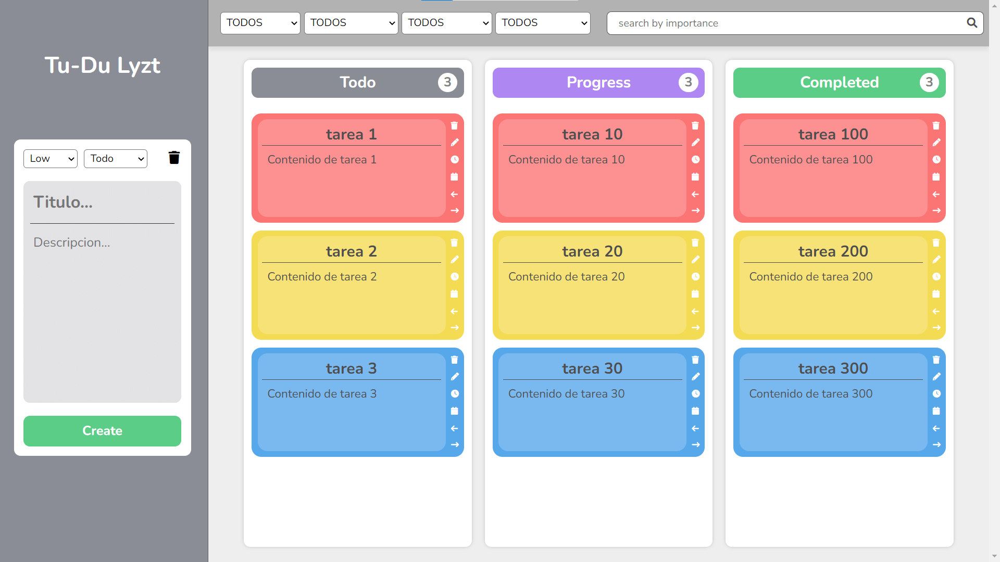

# Tu Du Lyzt

App para llevar un registro de tareas pendientes y completadas.

 

## 📌 Los usuarios deberían ser capaces de

- Crear y administrar una lista de tareas pendientes.
- Establecer prioridades o niveles de urgencia para cada tarea.
- Establecer fechas de vencimiento o plazos para las tareas.
- Marcar tareas como completadas una vez que se hayan terminado.
- Organizar las tareas por categorías o etiquetas.
- Recibir recordatorios o notificaciones para las tareas próximas a vencerse.

## 🔠 Fuente de texto

- Nunito - https://fonts.google.com/specimen/Nunito?query=nunito

## 🎨 Paleta de colores

  
  
  
  
  
  
  
  
  
  
  
  
  
  
  
  

## 🚀 Desarrollado con las siguientes tecnologias

  
 &nbsp;
  &nbsp; 
  
  

## 🌍 Despliegue y sitio web de la aplicacion

Puedes probar la aplicacion [aqui](https://github.com/GaredLyon/Tu-Du-Lyzt/).

